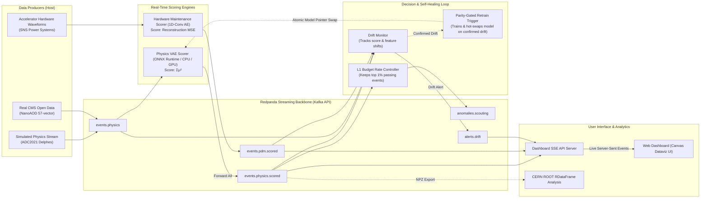

# PHAROS: Real-Time AI Anomaly Detection for Physics & Industrial Hardware

**PHAROS** (*Pipeline for High-throughput Anomaly Recognition in Online Streams*) is an open-source, real-time data streaming platform built to instantly detect unusual events (anomalies) in massive streams of data. 

It takes inspiration from **particle physics experiment triggers**—the ultra-fast computing systems at particle accelerators like CERN's Large Hadron Collider (LHC) that scan 40 million collision events per second and decide within microseconds which data to keep and which to discard forever. 

PHAROS proves that a **single streaming backbone** can simultaneously handle two complex tasks:
1. **Scientific Discovery (Stream A):** Filtering potential new physics events from live particle collision streams without needing to know beforehand what the new physics looks like (unsupervised anomaly detection).
2. **Industrial Predictive Maintenance (Stream B):** Monitoring high-voltage electrical hardware in particle accelerators to catch power system failures before catastrophic breakdowns occur.

---

## 💡 Potential for a Research Paper

PHAROS is not just a software project; it is a **rigorous research benchmark and experimental testbed** with several novel findings suitable for publication in journals focused on machine learning for physical sciences, real-time edge computing, or scientific data infrastructure (e.g., *IEEE Transactions on Nuclear Science*, *Computer Physics Communications*, or *NeurIPS AI for Science*).

### Key Research Contributions & Experimental Findings

#### 1. The Trigger Score vs. Offline Score Dilemma (Discriminative Loss)
* **Finding:** When running an AI model (a Variational Autoencoder, or VAE) on ultra-fast hardware like FPGAs, standard practice uses a fast, lightweight score: the sum of squared latent space means ($\Sigma\mu^2$). On the $A \to 4\ell$ particle signal, this cheap score achieves an **AUC of 0.775**. However, using full-model reconstruction error (MSE) from the exact same model checkpoint yields an **AUC of 0.889**—a massive **0.114 AUC recovery**.
* **Research Impact:** Demonstrates that hardware-constrained triggers inherently leave significant discrimination accuracy on the table. It provides empirical proof for a two-tier architecture: deploy cheap $\Sigma\mu^2$ on low-latency hardware triggers, but preserve full model decoders in nearline software pipelines to re-evaluate borderline events.

#### 2. Hardware Fixed-Point Precision Flips Trigger Decisions
* **Finding:** In real-time hardware inference (e.g., using `hls4ml` to convert neural networks for FPGAs), precision is usually measured by how closely the hardware output matches floating-point mathematical error. In PHAROS, we proved that near the decision boundary (the filter threshold), the tutorial-standard 16-bit fixed-point format (`ap_fixed<16,6>`) caused **9% of filtering decisions to flip incorrectly** (91% decision agreement). Expanding to a 24-bit representation (`ap_fixed<24,8>`) restored **100% decision agreement**.
* **Research Impact:** Establishes that **Trigger Decision Agreement**—not average mathematical error—must be the primary precision metric when quantizing edge models for hardware filtering.

#### 3. Empirical Characterization of the Sim-to-Real Domain Gap
* **Finding:** When real CMS detector data (ZeroBias Open Data from CERN) was streamed through a frozen model trained exclusively on synthetic computer simulations (Delphes simulation), the score distribution shifted drastically (**Kolmogorov-Smirnov statistic = 0.80, $p = 0.0$**, Population Stability Index = 4.52).
* **Research Impact:** While many publications test AI trigger models solely on synthetic simulation data, PHAROS explicitly measures and quantifies the severe performance degradation caused by real-world detector noise, pileup, and feature distribution shifts.

#### 4. Limitations of Drift Detection on High-Frequency Industrial Streams (Honest Negative Result)
* **Finding:** Standard machine learning drift detectors attempt to differentiate between "benign calibration shift" (harmless sensor variation) and "true distribution shift" (real failure). On high-frequency electrical waveforms (SNS HVCM hardware dataset), subtle raw channel variance caused statistical monitors to flag benign replay chunks as real shifts.
* **Research Impact:** Documents an important negative result: standard population stability metrics (PSI/KS) alone cannot reliably distinguish benign sensor drift from genuine machine degradation without explicit feature-level drift tracking.

---

## 📋 System Overview & Concepts Explained Simply

To understand PHAROS without complex jargon, here is how the core concepts map to real-world software and physics terms:

| Physics / Hardware Term | Plain English Explanation | Implementation in PHAROS |
| :--- | :--- | :--- |
| **L1 Trigger / Scouting** | A fast filter that discards 99%+ of uninteresting background data in real time, saving only suspicious or high-value events due to limited storage space. | `services/decision/physics_decision.py` enforces a 1% data accept budget per 1-second window. |
| **Variational Autoencoder (VAE)** | An AI model that learns what "normal" data looks like. When presented with strange or rare data, its internal representation or reconstruction error spikes, signaling an anomaly. | PyTorch MLP VAE (`57` inputs $\to$ `8` latent variables) trained on LHC collision backgrounds. |
| **Kafka / Redpanda Backbone** | A high-speed digital conveyor belt that allows multiple data producers and analytical scoring engines to talk to each other without slowing down. | Single-node Redpanda message broker running over high-throughput event topics. |
| **Concept Drift Monitoring** | An automated guardian that checks whether incoming live data still resembles the historical data used to train the AI model. | `services/monitor/drift_monitor.py` running statistical KS-tests & PSI metrics on streaming scores. |
| **Model Hot-Swapping** | Replacing a live AI model in memory with a retrained version without stopping the data flow or dropping incoming events. | Atomic pointer file update (`models/physics_vae/current.json`) polled by active scoring threads. |

---

## 🏗️ Architecture

PHAROS processes data across host Python processes, containerized message brokers, and CERN ROOT analytical environments:



---

## 📊 Key Results & Benchmark Summary

All benchmark results are empirically derived from reproducible runs recorded in the `reports/` folder:

| Benchmark Category | Metric | Measured Value | Meaning & Context |
| :--- | :--- | :--- | :--- |
| **Physics Accuracy** | Ultra-fast Trigger Score ($\Sigma\mu^2$) AUC | **0.775** | Accuracy of the FPGA-deployable fast score on $A \to 4\ell$ signal. |
| **Physics Accuracy** | Full Reconstruction Error (MSE) AUC | **0.889** | Accuracy when using full decoder offline (**+0.114 higher**). |
| **Hardware Maintenance** | Median Detection AUC | AE: **0.711** / IsoForest: **0.805** | Evaluated across 50 distinct hardware fault classes. |
| **Inference Speed** | Single-event Latency (ONNX Runtime CPU) | **7.4 µs / event** (p99: 15.6 µs) | Ultra-fast execution meeting software trigger requirements. |
| **Inference Speed** | PyTorch CPU Baseline | **32.0 µs / event** (p99: 91.2 µs) | ONNX Runtime delivers a **~4.3x speedup** over PyTorch. |
| **Pipeline Latency** | End-to-End Streaming Latency | Median: **6.0 ms** (p99: 10.5 ms) | Time from event creation to score publication over Kafka. |
| **Data Reduction** | Trigger Rate-Limiting Filter | **115x reduction** | Successfully throttles stream down to strict 1% L1 data budget. |
| **Drift Reaction** | Anomaly Detection Lead Time | **4.02 seconds** (2,002 events) | Speed at which system flags injected black-box signals. |
| **Domain Gap** | Sim vs. Real Data Shift | **KS = 0.80, $p = 0.0$** | Quantified difference between simulated and real CMS collision data. |
| **Hardware Quantization**| Fixed-Point Decision Agreement | `<16,6>`: **91%** vs `<24,8>`: **100%** | Proves higher bit-precision is mandatory for trigger accuracy. |

---

## ⚖️ System Emulation vs. Real Detector Systems

To maintain complete scientific honesty, the following table details where PHAROS faithfully mirrors a real CERN particle accelerator trigger and where it uses emulation:

| Feature | Faithful to Real Trigger Hardware | Emulated in PHAROS |
| :--- | :--- | :--- |
| **Filtering Strategy** | **Yes:** Uses unsupervised anomaly detection ($\Sigma\mu^2$) identical to CMS AXOL1TL / CICADA algorithms. | — |
| **Data Reduction** | **Yes:** Enforces microsecond-level rate budgets and top-$N$ candidate preservation. | — |
| **Data Format** | **Yes:** Employs standard physics feature representation (lepton vectors, transverse momentum, angles, missing energy). | — |
| **Data Source** | — | **Emulated:** Replays data from recorded files rather than receiving live silicon sensor hits at 40 MHz. |
| **Hardware Layer** | — | **Emulated:** Uses CPU/GPU ONNX Runtime scoring and static `hls4ml` synthesis estimation rather than custom FPGA boards. |
| **Data Processing Scale**| — | **Emulated:** Scales to ~40,000 events/sec micro-batches rather than 40,000,000 events/sec hardware buses. |

---

## 🚀 Quickstart & Reproducibility Guide

You can run the entire PHAROS pipeline on a single development laptop equipped with WSL2 / Linux and Docker Desktop.

### 1. Prerequisites
- **Operating System:** Ubuntu 22.04 LTS (via Windows WSL2 or native Linux).
- **Python Environment:** Python 3.11 with PyTorch, `confluent-kafka`, and `onnxruntime`.
- **Containers:** Docker Desktop with Compose support.

### 2. Basic Installation & Setup
```bash
# Clone the repository
git clone https://github.com/Rohit-Gupta-126/PHAROS.git
cd PHAROS

# Create & activate environment (Miniforge/Conda recommended)
mamba create -n pharos python=3.11 -y
mamba activate pharos

# Install core Python dependencies
pip install -r requirements-phase0.txt
```

### 3. Launching the Streaming Backbone
```bash
# Bring up the Redpanda message broker and web console container
make up

# Verify that Redpanda Console is accessible at http://localhost:8080
```

### 4. Running Pipeline Demos

#### Option A: Run End-to-End Streaming & Decision Layer (Phase 1 & 2)
```bash
# Derive decision thresholds from background data
make thresholds

# Run live streaming inference demonstration
make phase2
```

#### Option B: Real Data Processing (CMS Open Data)
```bash
# Download CMS Open Data NanoAOD sample (~1 GB)
make fetch-cms

# Process ROOT file into feature vector
make ingest-cms

# Stream real CMS events through the frozen VAE model and measure sim-to-real drift
make sim-vs-real
```

#### Option C: Live Technical Dashboard
```bash
# Start the lightweight Server-Sent Events (SSE) API server and dashboard
make dashboard-api

# Open http://127.0.0.1:8070 in your web browser to monitor live event rates, 
# score distributions, and drift alerts.
```

### 5. Cleaning Up
```bash
make down
```

---

## 📌 Project Structure

```
PHAROS/
├── README.md                      # Primary project documentation
├── PHAROS_BUILD_PLAN.md           # Master architectural development plan
├── Makefile                       # One-command execution targets
├── docker-compose.yml             # Redpanda broker & console definition
├── src/                           # Shared Python modules (schemas, io, models)
├── services/                      # Live streaming services
│   ├── producers/                 # Data stream replay engines
│   ├── scorers/                   # VAE & Conv-AE real-time scoring consumers
│   ├── decision/                  # L1 rate-control & scouting decision filters
│   ├── monitor/                   # Statistical drift monitor & auto-retrain trigger
│   └── dashboard_api/             # Real-time Server-Sent Events (SSE) bridge server
├── dashboard_web/                 # Static high-performance Canvas dataviz dashboard
├── analysis/                      # Offline CERN ROOT RDataFrame plotting scripts
├── configs/                       # System parameters and model threshold JSONs
├── models/                        # Saved neural network checkpoints and current pointer
├── reports/                       # Generated benchmark metrics, JSONs, and evaluation plots
└── tests/                         # Unit tests and smoke tests for all components
```

---

## 🛠️ Limitations & Future Research Directions

1. **FPGA Hardware Deployment:** `hls4ml` conversion is evaluated via static resource estimation and C-emulation. Full Vivado/Vitis synthesis onto physical FPGA hardware remains an active area for follow-up testing.
2. **SOFIE C++ Execution Engine:** CERN's TMVA SOFIE parser compilation recipe is provided in `docker/root-sofie.Dockerfile`, while ONNX Runtime serves as the active, zero-overhead runnable deployment path.
3. **Advanced Drift Disambiguation:** Differentiating benign calibration drift from operational machine decay on industrial streams requires adding multi-variate feature-level drift rules to the current monitoring engine.

---

## 📜 Citation & License

If you use PHAROS in your research or project, please cite this repository:

```bibtex
@software{pharos2026,
  author = {Rohit Gupta},
  title = {PHAROS: Pipeline for High-throughput Anomaly Recognition in Online Streams},
  url = {https://github.com/Rohit-Gupta-126/PHAROS},
  year = {2026}
}
```

Distributed under the **MIT License**.
