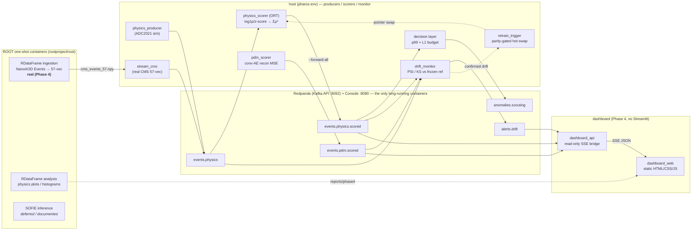

# PHAROS

**Pipeline for High-throughput Anomaly Recognition in Online Streams**

One streaming, DAQ-style backbone serving *both* model-independent new-physics event
filtering *and* accelerator hardware predictive maintenance — with drift-aware
unsupervised detection and multiple trigger-realistic inference paths off a single
Kafka-protocol wire. It emulates the last stage of an LHC trigger/DAQ system at student
scale, and it is deliberate about which parts are faithful to a real trigger and which
are emulation.

---

## Four headline findings

Read these first; the rest of the README is evidence for them.

1. **The cheap trigger score leaves real discrimination on the table.** The
   AXOL1TL/CICADA-style FPGA-deployable anomaly score (Σμ², encoder-only latent means)
   reaches **AUC 0.775** on A→4ℓ, while full-VAE reconstruction MSE from the *same*
   checkpoint reaches **AUC 0.889**. The decoder recovers a 0.11-AUC gap that the cheap
   trigger score cannot see — so Σμ² is the right thing to deploy on the FPGA, and
   recon-MSE is the right thing to run offline.

2. **When the score lives near the accept cut, trigger-*decision* agreement is the
   precision metric — not reconstruction error.** For hls4ml fixed-point inference, the
   tutorial-default `ap_fixed<16,6>` gives only **91% p99 trigger-decision agreement**
   because μ sits near the ~1×10⁻³ accept threshold; **`ap_fixed<24,8>` restores 100%
   agreement** (max |Δμ| ≈ 6×10⁻⁴). Judging by reconstruction error alone would have
   hidden the decision flips.

3. **Honest negative result: the drift monitor cannot separate benign skew from a real
   shift on the PDM stream.** The intended "score-PSI-only ⇒ calibration-suspect,
   score+feature-PSI ⇒ real shift" signature *did not separate* the cases — the
   file-head replay slice moved every tracked raw channel-mean PSI (1.5–3.0), so it is
   indistinguishable from a genuine distribution shift on the tracked metrics. This is
   documented as a limitation in `reports/phase3/pdm_skew_analysis.json`, not tuned away.

4. **The sim-to-real domain gap, measured.** Streaming real CMS ZeroBias (minimum-bias)
   Open Data through the *frozen, Delphes-sim-trained* scorer, the anomaly-score
   distribution **alone** separates real data from simulation at **KS = 0.80, p = 0**
   (`physics::score_psi`, KS stat 0.8035). The sim/data gap that the ADC2021 authors
   flagged as unaddressed is here quantified on a real detector stream through an
   unchanged model.

---

## What it is — two streams, one backbone

- **Stream A — physics events.** A model-independent new-physics filter: an
  AXOL1TL/CICADA-style variational autoencoder scoring events by Σμ² over its latent
  means. Trained on ADC2021 Delphes simulation; also fed **real CMS Open Data** NanoAOD
  through the identical wire format.
- **Stream B — accelerator predictive maintenance.** A 1D convolutional autoencoder
  (reconstruction-MSE score) on **real SNS HVCM** power-system waveforms, with an
  IsolationForest baseline.

Both detectors publish onto a shared **Redpanda / Kafka** backbone:
`scorers → decision / rate-control layer → drift monitor → parity-gated retrain loop →
dashboard`. Producers, scorers, and the monitor are host Python processes; only Redpanda
+ Console run as long-lived containers; ROOT runs as one-shot containers.

---

## Architecture



Three ROOT slots, with honest per-slot status:

| Slot | Status | What runs |
|------|--------|-----------|
| **RDataFrame ingestion** | **real (Phase 4)** | reads a CMS Open Data NanoAOD `Events` tree, maps objects → the 57-feature ADC2021 vector, writes `.npy`; `stream_cms.py` replays it through the Phase 1 producer interface. |
| **RDataFrame analysis** | **real (Phase 4)** | books overlaid background-vs-signal histograms with implicit MT; AUCs computed host-side. |
| **SOFIE inference** | **deferred / documented** | the `rootproject/root` image ships the SOFIE runtime but not the ONNX parser; the `-Dtmva-sofie=ON` build is multi-hour / >8 GB. Recipe recorded; **ONNX Runtime is the runnable deploy path.** |

---

## Emulation vs real trigger — where PHAROS is which

This section is deliberately un-hyped. Claiming exactly the right amount is the point.

**Faithful to a real trigger:**
- Unsupervised, model-independent anomaly score (Σμ² over VAE latent means — the
  AXOL1TL/CICADA convention).
- L1-style latency-budget framing and a rate-control / keep-top-N decision layer (per-1 s
  window accept budget, threshold-pass vs rate-limited reasons).
- Quantization / FPGA-resource constraints taken seriously (hls4ml fixed-point +
  DSP/latency estimate, precision judged by trigger-decision agreement).
- A Kafka-protocol streaming backbone with one honest wire format shared by sim and real
  producers.

**Emulation, NOT the real thing:**
- Replayed streams, not live detector readout.
- ~100k-event scale, not 40 MHz. (Physics AUC table: 100,000 background / 55,969 signal
  events; streaming demos at 500 ev/s.)
- No custom FPGA boards: hls4ml is a **synthesis estimate + documented recipe** (no local
  Vivado/Vitis); the SOFIE C++ build is **deferred**.
- **ONNX Runtime is the deployed inference path**, not SOFIE and not an FPGA.

---

## Results & benchmarks

All figures pulled from `reports/` and `docs/`; none invented.

| Metric | Value | Source |
|--------|-------|--------|
| Physics AUC — Σμ² trigger score (A→4ℓ) | **0.775** | `reports/phase4/physics_auc_table.json` |
| Physics AUC — recon-MSE offline (same checkpoint) | **0.889** | `reports/phase4/physics_auc_table.json` |
| PDM median AUC (n≥5 classes) | AE **0.711** / IsolationForest **0.805** | `docs/design_log.md` (Phase 0.5) / `reports/phase0/pdm_auc.csv` |
| Trigger inference latency (ORT, batch 1, CPU) | **7.4 µs/event** mean (p99 15.6 µs) | `reports/phase2/inference_latency.json` |
| Trigger inference latency (PyTorch, same) | 32.0 µs/event mean (p99 91.2 µs) | `reports/phase2/inference_latency.json` |
| ORT vs PyTorch | ~4.3× faster; parity 1.9×10⁻⁶ ≤ 1e-5 | `reports/phase2/inference_latency.json` |
| Streaming e2e latency (physics, ORT) | p50 **6.0 ms** (p99 10.5 ms) | `reports/phase2/physics_ort_stream_metrics.json` |
| Unthrottled scoring capacity | ~40k events/s (GPU micro-batch 256) | Phase 1 |
| Decision reduction factor (1% L1 budget) | **115×** (87 kept / 10,000; 12 rate-dropped) | `reports/phase2/decision_stats.json` |
| Drift detection lead time | **4.02 s** / 2,002 messages (one 2,000-event window) | `reports/phase3/lead_time.json` |
| Sim→real domain gap (score alone) | **KS = 0.80, p = 0** (score_psi max PSI 4.52) | `reports/phase4/sim_vs_real_drift.json` |
| hls4ml precision → trigger decision | `<16,6>` **91%** vs `<24,8>` **100%** p99 agreement | `reports/phase2/hls4ml_estimate.json` / `docs/design_log.md` |
| hls4ml static estimate | 2,520 params / 2,464 MACs → ~2.5k DSPs @ RF1, O(100 ns) @ 200 MHz | `reports/phase2/hls4ml_estimate.json` |

Scores are heavy-tailed and non-negative; **medians** are quoted alongside means because
recon-MSE means are outlier-dominated.

---

## Quickstart / reproducibility

**Manual prerequisites (one-time):**
- WSL2 + Docker Desktop (WSL backend). The runtime env is the WSL Ubuntu-22.04 `pharos`
  conda env (Python 3.11, `torch 2.11.0+cu128`, CUDA on RTX 2050 4 GB); code is
  device-agnostic and also runs CPU-only.
- Datasets: ADC2021 background + A→4ℓ signal (`data/raw/adc2021/`), SNS HVCM waveforms
  (`data/raw/`), and — for the real path — a **CMS Open Data ZeroBias PFNano** NanoAOD
  file (~1.05 GB), HTTPS-downloaded with `curl -k` + adler32 checksum via `make
  fetch-cms`.

**One-command-ish demo path:**

```bash
make up               # Redpanda + Console + topics (only long-running containers)

# real-data ROOT path (one-shot containers):
make fetch-cms        # download a NanoAOD ZeroBias file into data/raw/cms_opendata/
make ingest-cms       # RDataFrame → data/interim/cms_events_57.npy
make sim-vs-real      # stream real events → reports/phase4/sim_vs_real_drift.json

# per-phase demos:
make phase1 / phase2 / phase3     # streaming, decision+inference, drift+retrain
make analysis-prep    # host AUC table + observables
make analysis-rdf     # RDataFrame histograms → reports/phase4/

make dashboard-api    # live panel at http://127.0.0.1:8070/
make down
```

Deterministic seeds (1337 family) across training/eval/reference derivation; frozen
artifacts under `models/`; per-phase metrics under `reports/phaseN/`; every decision
logged in [docs/design_log.md](docs/design_log.md). The active model is the inspectable
pointer `models/physics_vae/current.json` (atomic `os.replace`, restart-safe).

---

## Limitations & what's next

The limitations *are* the credibility. Nothing below is hidden in a footnote.

- **SOFIE C++ build deferred.** The `rootproject/root` image lacks the ONNX parser (and
  XRootD); the `-Dtmva-sofie=ON` build is multi-hour / >8 GB, over this laptop's stop
  rule. A ready-to-compile BLAS-only `main.cpp` and a build recipe are committed; **ONNX
  Runtime is the runnable deploy path.**
- **Drift score-vs-feature separability is an open problem** (finding 3): on the PDM
  stream the intended benign-skew signature does not separate benign replay/calibration
  skew from a real shift. Note toward future work: for near-background anomalies, feature
  PSI is a better trigger signal than score PSI (leading-jet-pT feature PSI hit 0.42
  while the score barely moved).
- **Sim-to-real gap is characterized, not closed** (finding 4): the real CMS stream
  drives the frozen scorer to KS 0.80 vs sim; no artifact is retuned to hide it.
- **hls4ml full Vitis HLS synthesis is a documented one-time recipe**, not run locally
  (no Vivado/Vitis on this machine); the reported DSP/latency figures are static
  estimates + C-emulation, not a place-and-route.
- **Retrain is demo-scale** (6 epochs / 500k events vs Phase 0's 20 / 2M) and replays a
  Phase 0 background rather than freshly captured data — a production loop would retrain
  on live background.
