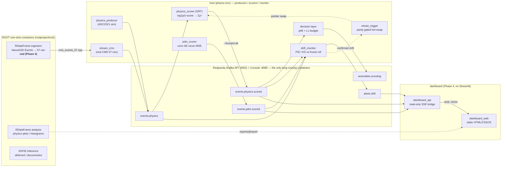

# PHAROS architecture (final, through Phase 4)

PHAROS is a real-time streaming anomaly-detection service emulating the last
stage of an LHC trigger/DAQ system. Two unsupervised detectors share one
Kafka-protocol backbone — (A) a model-independent new-physics event filter
(AXOL1TL/CICADA-style VAE) and (B) accelerator predictive maintenance on real
power-system waveforms — behind an L1-style rate-control decision layer and an
MLOps drift/retrain loop. Phase 4 adds a **real** CMS Open Data ingestion path
and a hand-built web dashboard.

## System diagram



## The three ROOT slots

| Slot | Status | What runs |
|------|--------|-----------|
| **RDataFrame ingestion** | **real (Phase 4)** | `services/ingest_root/ingest_nanoaod.py` reads a CMS Open Data NanoAOD `Events` tree, maps objects → the 57-feature ADC2021 vector, writes `.npy`; `stream_cms.py` replays it through the Phase 1 producer interface. See [ingest_root.md](ingest_root.md). |
| **RDataFrame analysis** | **real (Phase 4)** | `analysis/physics_rdf.py` books overlaid background-vs-signal histograms with implicit MT; AUCs computed host-side in `analysis/prep_adc_npy.py`. |
| **SOFIE inference** | deferred / documented | `rootproject/root` ships the SOFIE runtime but not the ONNX parser; building `-Dtmva-sofie=ON` is a multi-hour >8 GB build. Recipe in [hls4ml_synthesis.md](hls4ml_synthesis.md) and `services/inference_sofie/`. **ONNX Runtime is the runnable deploy path.** |

## Topics (all single-partition)

| topic | producer | consumer |
|-------|----------|----------|
| `events.physics` | physics_producer / stream_cms | physics_scorer, monitor |
| `events.physics.scored` | physics_scorer `--forward-all` | decision, monitor, dashboard_api |
| `events.pdm` | pdm_producer | pdm_scorer |
| `events.pdm.scored` | pdm_scorer `--forward-all` | monitor, dashboard_api |
| `anomalies.scouting` | decision layer | (sink) |
| `alerts.drift` | drift_monitor | dashboard_api |
| `ctrl.inject` | injectors (Phase 3) | measure_lead_time (post-hoc) |

## Benchmark table

| Metric | Value | Source |
|--------|-------|--------|
| Trigger inference latency (ORT, batch 1, CPU) | **7.4 µs/event** mean, p99 15.6 µs | `reports/phase2/inference_latency.json` |
| Inference vs PyTorch | ~4.3× faster; parity ≤ 1e-5 | Phase 2 |
| Streaming e2e latency (physics) | p50 5.5 ms | `reports/phase2/decision_stats.json` |
| Unthrottled scoring capacity | ~40k events/s (GPU micro-batch 256) | Phase 1 |
| **Reduction factor** (1% L1 budget) | **115×** | `reports/phase2/decision_stats.json` |
| Drift detection lead time | **4.02 s** (1× 2000-event window) | `reports/phase3/lead_time.json` |
| Physics AUC — Σμ² trigger score | **0.775** (0.766 Phase 0) | `reports/phase4/physics_auc_table.json` |
| Physics AUC — recon-MSE offline | **0.889** | Phase 0.5 / Phase 4 |
| PDM detection — median AUC (n≥5) | AE **0.711** / IsoForest **0.805** | `reports/phase0/pdm_auc.csv` |
| hls4ml precision → trigger decision | `<16,6>` 91% vs **`<24,8>` 100%** p99 agreement | `reports/phase2/hls4ml_estimate.json` |
| Sim→real domain gap | reported PSI/KS per feature + score | `reports/phase4/sim_vs_real_drift.json` |

Scores are heavy-tailed; **medians** are quoted alongside means (recon-MSE means
are outlier-dominated).

## Design invariants

- **Only Redpanda + Console are long-running containers.** Producers/scorers/
  monitor are host Python processes (RAM budget on the 12 GB WSL guest, direct
  GPU access). ROOT runs as `docker run --rm` one-shots.
- **One wire format.** Sim and real producers emit the identical
  `pharos.physics.v1` record (raw pre-normalization 57-vectors); the scorer owns
  normalization — a single source of truth.
- **Frozen references.** Thresholds, drift references, and the normalizer are
  frozen at Phase 0; nothing is refit outside the parity-gated retrain loop.
- **Honest measurement.** The monitor is marker-blind; lead time is a post-hoc
  join. The sim→real gap and the drift-separability negative result are reported,
  not tuned away.

## One-command demo

```bash
make up                 # Redpanda + Console + topics (only long-running containers)

# Real-data ROOT path (one-shot containers):
make fetch-cms          # xrdcp a NanoAOD file into data/raw/cms_opendata/
make ingest-cms         # RDataFrame → data/interim/cms_events_57.npy
make sim-vs-real        # stream real events → reports/phase4/sim_vs_real_drift.json

# Offline analysis (one-shot container + host scoring):
make analysis-prep      # host: AUC table + observables npz
make analysis-rdf       # RDataFrame histograms → reports/phase4/

# Live dashboard (host bridge + static page):
make dashboard-api      # open http://127.0.0.1:8070/

make down
```

## Reproducibility

Deterministic seeds (1337 family) across training/eval/reference derivation.
Frozen artifacts under `models/`; per-phase metrics under `reports/phaseN/`;
every decision logged in [design_log.md](design_log.md). The active model is the
pointer `models/physics_vae/current.json` (atomic `os.replace`, inspectable,
restart-safe). Phase 4 introduces no new training — it reuses the active pointer.
